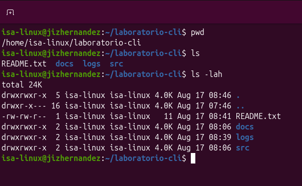

| Archivo    | Permisos simbólicos | Notación octal |
|------------|----------------------|-----------------|
| docs       | drwxrwxr-x           | 775             |
| logs       | drwxrwxr-x           | 775             |
| src        | drwxrwxr-x           | 775             |
| README.txt | -rw-rw-r--           | 664             |

## Captura de pantalla

