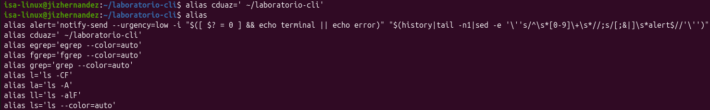
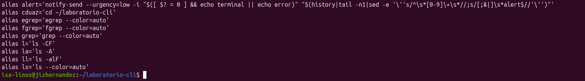
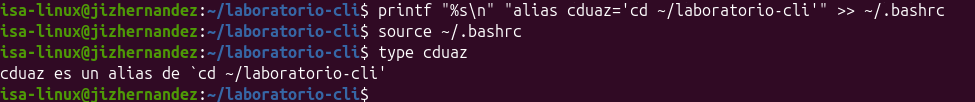
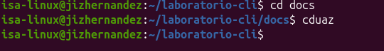

# Evidencia de práctica: Alias `cduaz` y listado de alias

**Usuario:** isa-linux@jizhernandez
**Directorio de trabajo:** `~/laboratorio-cli`

## Objetivo

Investigar el comando para listar todos los alias definidos en la sesión de Bash, y realizar la práctica de la diapositiva 15: crear un alias personalizado llamado `cduaz` que permita regresar rápidamente al directorio `~/laboratorio-cli`, dejarlo disponible de forma permanente y comprobar su funcionamiento.

---

## Paso 1: Creación del alias `cduaz` (temporal)

Se crea el alias directamente en la terminal con el comando `alias`, que define un atajo asociado a un comando de Bash:

```bash
alias cduaz='cd ~/laboratorio-cli'
```



Este alias solo existe **mientras dure la sesión actual** de la terminal; si se cierra la ventana o se abre una nueva terminal, el alias desaparece porque no ha sido guardado en ningún archivo de configuración todavía.

---

## Paso 2: Comando para listar todos los alias

Para comprobar que el alias fue creado correctamente (y para investigar cómo se listan **todos** los alias activos en la sesión), se utiliza el comando:

```bash
alias
```

Este comando, sin argumentos, muestra la lista completa de alias definidos, tanto los que trae el sistema por defecto (`ls`, `grep`, `egrep`, `fgrep`, `l`, `la`, `ll`, `alert`) como el alias `cduaz` recién creado:



En la salida se observa la línea:

```
alias cduaz='cd ~/laboratorio-cli'
```

lo que confirma que el alias quedó registrado correctamente con el comando `cd` apuntando al directorio del laboratorio.

---

## Paso 3: Hacer el alias permanente con `printf` y `~/.bashrc`

Como el alias creado en el Paso 1 solo es válido para la sesión actual, se agrega la definición al archivo de configuración `~/.bashrc` para que se cargue automáticamente cada vez que se abra una terminal. Para esto se usa `printf` junto con una redirección de anexado (`>>`):

```bash
printf "%s\n" "alias cduaz='cd ~/laboratorio-cli'" >> ~/.bashrc
source ~/.bashrc
type cduaz
```

- `printf "%s\n" "..."` escribe el texto exacto del alias seguido de un salto de línea.
- `>> ~/.bashrc` anexa esa línea al final del archivo `.bashrc`, sin borrar su contenido previo.
- `source ~/.bashrc` recarga el archivo en la sesión actual para que el nuevo alias quede activo sin necesidad de cerrar la terminal.
- `type cduaz` verifica qué es `cduaz` para Bash y confirma que es un alias.



La salida `cduaz es un alias de `cd ~/laboratorio-cli'` confirma que el alias ya quedó guardado de forma permanente en `~/.bashrc` y reconocido por el sistema.

---

## Paso 4: Prueba de funcionamiento del alias

Finalmente, se comprueba que el alias funciona correctamente cambiando de directorio y ejecutando `cduaz` para regresar al directorio base:

```bash
cd docs
cduaz
```



Se observa que:

1. `cd docs` cambia el directorio de trabajo a `~/laboratorio-cli/docs`.
2. Al ejecutar `cduaz`, el prompt regresa inmediatamente a `~/laboratorio-cli`, confirmando que el alias ejecuta correctamente `cd ~/laboratorio-cli` sin importar en qué subdirectorio nos encontremos.

---

## Conclusión

- El comando `alias` (sin argumentos) permite **listar todos los alias** activos en la sesión de Bash.
- Un alias creado con `alias nombre='comando'` solo es temporal y se pierde al cerrar la terminal.
- Para que un alias sea permanente, debe agregarse al archivo `~/.bashrc` (por ejemplo con `printf ... >> ~/.bashrc`) y recargarse con `source ~/.bashrc`.
- El alias `cduaz` fue creado, verificado en el listado de alias, hecho persistente y probado con éxito, cumpliendo el objetivo de la práctica de la diapositiva 15.
